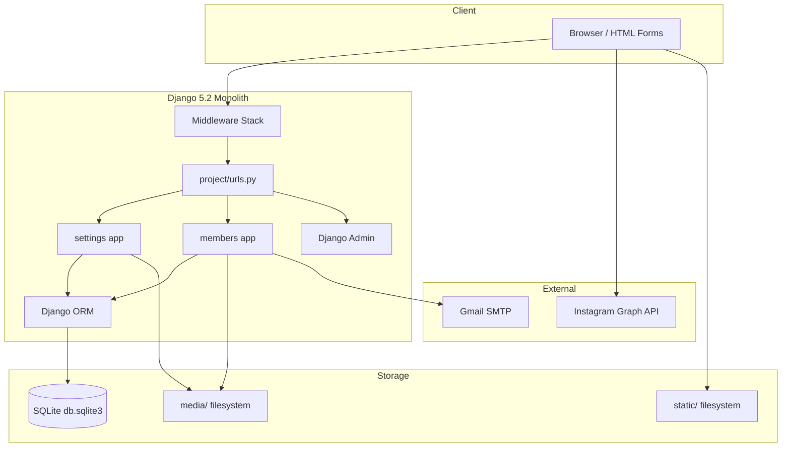
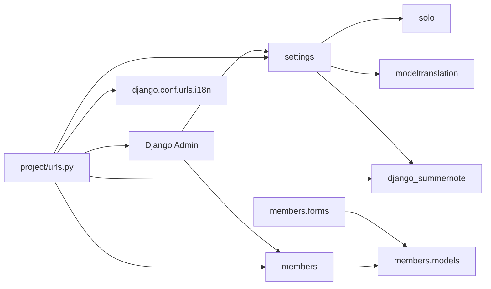
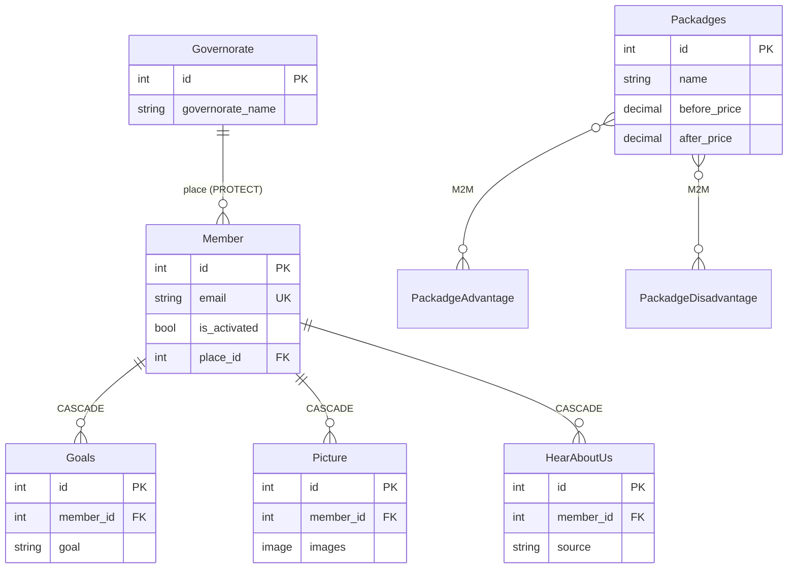
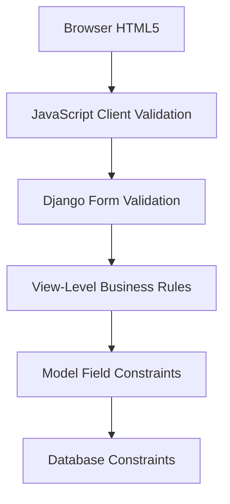
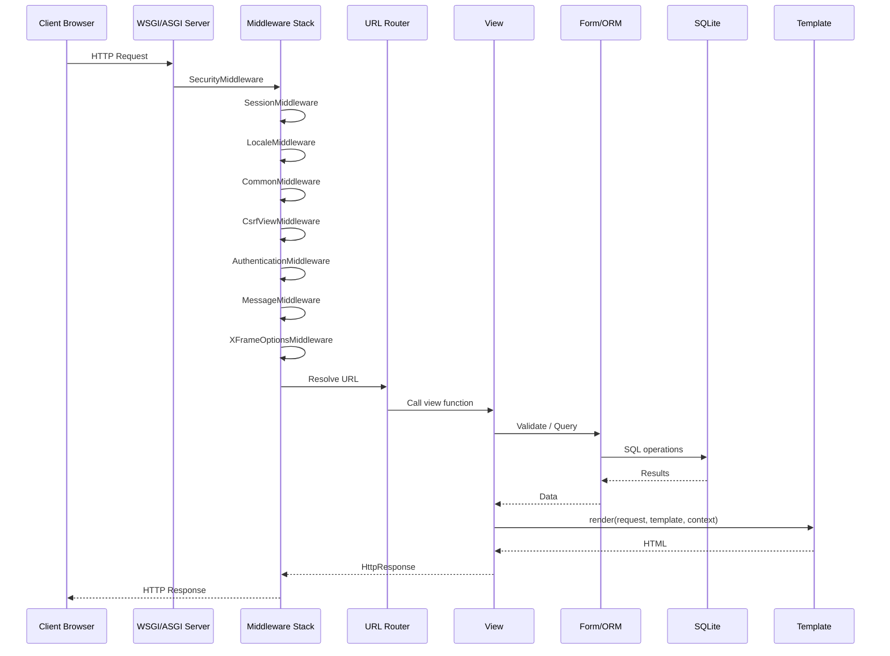

# FITRA — Django Enterprise Project Analysis

---

## Cover

| Metric | Value |
|--------|-------|
| **Project Name** | FITRA (Online Fitness Coaching Platform) |
| **Analysis Date** | July 9, 2026 |
| **Django Version** | 5.2.6 (confirmed via runtime; `settings.py` header references 5.2.6; migrations generated with 5.2.5–5.2.6) |
| **Python Version** | 3.14.2 (confirmed via runtime) |
| **Number of Custom Django Apps** | 2 (`settings`, `members`) |
| **Number of Models** | 14 (9 in `settings`, 5 in `members`) |
| **Number of Custom Views** | 3 function-based views |
| **Number of URL Routes (custom, user-facing)** | 7 primary routes + Django admin + Summernote + i18n |
| **Number of Active Django Templates** | 6 (excluding `Frontend-Templates/` prototypes) |
| **Number of API Endpoints** | 0 (no Django REST Framework) |
| **Number of Tests** | 0 implemented (2 placeholder `TestCase` files) |
| **Number of Migrations** | 8 migration files |
| **Estimated Project Size** | ~400 tracked files; ~67,000 total lines (includes minified JS/CSS); ~1,500 lines of application Python |

---

## Table of Contents

1. [Executive Summary](#executive-summary)
2. [Project Structure](#project-structure)
3. [Architecture Analysis](#architecture-analysis)
4. [Dependency Analysis](#dependency-analysis)
5. [URL Analysis](#url-analysis)
6. [Models Analysis](#models-analysis)
7. [Database Analysis](#database-analysis)
8. [Views Analysis](#views-analysis)
9. [Forms Analysis](#forms-analysis)
10. [Serializer Analysis](#serializer-analysis)
11. [Authentication & Authorization](#authentication--authorization)
12. [Validation Analysis](#validation-analysis)
13. [Business Logic](#business-logic)
14. [API Analysis](#api-analysis)
15. [Template Analysis](#template-analysis)
16. [Static Files](#static-files)
17. [Middleware](#middleware)
18. [Signals](#signals)
19. [Services](#services)
20. [Utilities](#utilities)
21. [Performance Analysis](#performance-analysis)
22. [Security Audit](#security-audit)
23. [Code Quality](#code-quality)
24. [Feature Inventory](#feature-inventory)
25. [Request Lifecycle](#request-lifecycle)
26. [Data Flow](#data-flow)
27. [Improvement Roadmap](#improvement-roadmap)
28. [Technical Debt](#technical-debt)
29. [Missing Tests](#missing-tests)
30. [Refactoring Opportunities](#refactoring-opportunities)
31. [Conclusion](#conclusion)

---

## Executive Summary

### What the System Does

FITRA is a bilingual (English/Arabic) web application for an online fitness coaching business. It provides:

1. A **marketing landing page** displaying CMS-managed content (logo, slogan, about section, success stories, pricing packages, social links, footer).
2. A **member registration intake form** collecting detailed fitness, nutrition, lifestyle, and contact data.
3. An **email activation workflow** using signed tokens to confirm member registrations before they appear in the admin panel.

The system is **not** a member portal. Registered members do not log in, manage profiles, or access training content through the application. Data flows one-way: prospect → registration form → database → admin review.

### Target Users

| User Type | Role |
|-----------|------|
| **Prospective members** | Complete the registration form and activate via email |
| **FITRA staff / coaches** | Manage site content and review activated members via Django Admin |
| **Site visitors** | Browse the landing page, view packages, and switch language |

### Major Features

- Bilingual UI (English/Arabic) via Django i18n and `django-modeltranslation`
- CMS-style singleton content blocks (`django-solo`) for site branding
- Rich-text admin editing (`django-summernote`)
- Multi-step member intake with gender-specific validation (photos for males, measurements for females)
- Email activation with 24-hour signed token expiry
- Success stories carousel and pricing package display
- Instagram follower count integration (client-side, placeholder token)

### Overall Architecture

Classic **Django MVT monolith** with two custom apps:

- `settings` — public homepage and CMS models
- `members` — registration and member data models

Business logic lives primarily in **views** (`members/views.py`) with no dedicated service layer, repository pattern, or REST API. Third-party packages handle translation, singleton CMS records, and admin rich text.



### Overall Quality Assessment

| Dimension | Assessment |
|-----------|------------|
| **Functionality** | Core flows (homepage, registration, activation) are implemented and coherent |
| **Architecture** | Simple and appropriate for project size; lacks layering for future growth |
| **Security** | **Not production-ready** — hardcoded secrets, DEBUG=True, XSS surface via `\|safe`, no rate limiting |
| **Testing** | Effectively absent |
| **Performance** | Acceptable at small scale; N+1 queries on homepage packages |
| **Maintainability** | Readable code with consistent Django conventions; fat views and duplicated activation error handling |
| **Documentation** | No `requirements.txt`, no in-repo README at workspace root; minimal inline comments |

---

## Project Structure

### Folder Tree

```
FITRA/src/
├── manage.py
├── project/                    # Django project configuration
│   ├── settings.py
│   ├── urls.py
│   ├── wsgi.py
│   └── asgi.py
├── settings/                   # Homepage & CMS app
│   ├── models.py
│   ├── views.py
│   ├── urls.py
│   ├── admin.py
│   ├── translation.py
│   ├── migrations/
│   ├── templates/settings/
│   └── locale/ar/LC_MESSAGES/
├── members/                    # Registration app
│   ├── models.py
│   ├── views.py
│   ├── forms.py
│   ├── urls.py
│   ├── admin.py
│   ├── migrations/
│   ├── templates/members/
│   └── locale/ar/LC_MESSAGES/
├── templates/
│   └── admin/base_site.html    # Admin language switcher override
├── static/                     # Collected/served static assets
│   ├── css/
│   └── js/
├── Frontend-Templates/         # Static HTML prototypes (NOT wired to Django)
├── locale/ar/LC_MESSAGES/      # Project-level Arabic translations
└── .gitignore
```

**Note:** `db.sqlite3`, `media/`, `staticfiles/`, and `venv/` are gitignored and not present in the repository snapshot.

### Django Apps

| App | Purpose | Key Modules |
|-----|---------|-------------|
| `settings` | Landing page content management and rendering | `models.py`, `views.py`, `admin.py`, `translation.py` |
| `members` | Member registration, activation, and data storage | `models.py`, `views.py`, `forms.py`, `admin.py` |

### Third-Party Installed Apps

| Package | Purpose |
|---------|---------|
| `modeltranslation` | Field-level AR/EN translation for CMS models |
| `django_summernote` | WYSIWYG rich text in admin |
| `widget_tweaks` | Form widget helpers (installed but **not used** in templates) |
| `solo` | Singleton model pattern for site-wide settings |
| `django.contrib.*` | Admin, auth, sessions, messages, staticfiles |

### Internal Packages / Shared Modules

**None identified.** There is no `core/`, `common/`, `utils/`, or `services/` package. Shared choice constants live in `members/models.py` and are imported by `members/forms.py`.

### Configuration Files

| File | Purpose |
|------|---------|
| `project/settings.py` | All Django configuration (DB, email, i18n, static/media) |
| `project/urls.py` | Root URL routing |
| `.gitignore` | Excludes secrets dirs, db, media, staticfiles, IDE files |

**Missing configuration (cannot be determined from source):**
- No `requirements.txt`, `Pipfile`, or `pyproject.toml` in the repository
- No `.env` usage (email/secret key hardcoded in `settings.py`)
- No Docker, CI/CD, or deployment configuration files

---

## Architecture Analysis

### Pattern Identification

| Pattern | Present? | Evidence |
|---------|----------|----------|
| **Layered Architecture** | Partial | Models → Views → Templates; no service/repository layer |
| **MVC / MVT** | Yes | Standard Django MVT |
| **Service Layer** | No | Business logic in `members/views.py` |
| **Repository Pattern** | No | Direct ORM calls in views |
| **Signals** | No | No `@receiver` or `post_save` handlers found |
| **Middleware** | Yes | Standard Django middleware only |
| **Dependency Injection** | No | No DI container or injectable services |
| **Singleton (CMS)** | Yes | Via `django-solo` (`SingletonModel`) |
| **Form Object Pattern** | Yes | `RegistrationForm` encapsulates validation |

### Design Patterns Observed

- **Singleton Pattern** — `Info`, `Brief`, `AboutUs`, `Footer`, `SocialLinks` via `solo.models.SingletonModel`
- **Inline Admin Pattern** — `GoalsInline`, `PictureInline`, `HearAboutUsInline` in member admin
- **Signed Token Pattern** — `TimestampSigner` for email activation links
- **Translation Proxy Pattern** — `django-modeltranslation` adds `_ar` / `_en` field variants

### SOLID Adherence

| Principle | Assessment |
|-----------|------------|
| **S — Single Responsibility** | Weak — `register()` view handles validation, persistence, email, and response rendering |
| **O — Open/Closed** | Neutral — choice constants in models require code changes for new options |
| **L — Liskov Substitution** | N/A — minimal inheritance |
| **I — Interface Segregation** | N/A |
| **D — Dependency Inversion** | Weak — views tightly coupled to ORM and `send_mail` |

### DRY Adherence

| Issue | Location |
|-------|----------|
| Duplicated activation failure handling | `activate_account()` — nearly identical blocks for `SignatureExpired` and `(BadSignature, DoesNotExist)` |
| Duplicated frontend assets | `Frontend-Templates/` mirrors `static/` (legacy prototypes) |
| Choice constants duplicated conceptually | Same enums in model and form imports (acceptable coupling) |

### Separation of Concerns

| Layer | Separation Quality |
|-------|------------------|
| Models vs Views | Moderate — minimal model methods; logic in views |
| Views vs Templates | Good — templates render; limited logic |
| Admin vs Public | Good — admin filters activated members only |
| CMS vs Members | Good — separate apps |

### Strengths

- Clear two-app split (`settings` vs `members`)
- Consistent use of Django forms for server-side validation
- i18n integrated at model, template, and email levels
- Admin customized with inlines and translation support

### Weaknesses

- No service layer — views will grow unwieldy with new features
- No tests — regressions undetectable
- No environment-based configuration
- `Frontend-Templates/` creates confusion about source of truth
- Namespace mismatch between URL include and `app_name` (see URL Analysis)

---

## Dependency Analysis

### App Dependency Graph



### Import Relationships

| Module | Imports From |
|--------|--------------|
| `members.views` | `members.forms`, `members.models`, Django core |
| `members.forms` | `members.models` (choice constants) |
| `members.admin` | `members.models` |
| `settings.views` | `settings.models` |
| `settings.admin` | `settings.models`, `modeltranslation`, `django_summernote`, `solo` |
| `settings.translation` | `settings.models`, `modeltranslation` |

**Cross-app imports:** None. `settings` and `members` are fully decoupled at the Python import level. They connect only via URL links in templates (``).

### Circular Dependency Risks

**None detected.** The dependency graph is acyclic.

### Coupling Assessment

| Coupling Type | Level | Notes |
|---------------|-------|-------|
| App-to-app | Low | No direct imports between apps |
| View-to-ORM | High | Views perform all persistence directly |
| Template-to-app | Medium | Templates reference named URL namespaces |
| Settings-to-secrets | High | SMTP credentials in source file |

### Cohesion Assessment

| App | Cohesion | Notes |
|-----|----------|-------|
| `settings` | High | All models serve homepage/CMS |
| `members` | High | All models serve registration workflow |

---

## URL Analysis

### Root URL Configuration

Source: `project/urls.py`

| Path Prefix | Included Module | Namespace | Purpose |
|-------------|-----------------|-----------|---------|
| `admin/` | `django.contrib.admin` | `admin` | Staff CMS and member management |
| `` (empty) | `settings.urls` | `settings` (include) / `home` (app_name) | Homepage |
| `register/` | `members.urls` | `members` | Member registration |
| `summernote/` | `django_summernote.urls` | None | Admin WYSIWYG editor assets |
| `i18n/` | `django.conf.urls.i18n` | None | Language switching |
| `^static/` | Django static helper | — | Static file serving (dev pattern) |
| `^media/` | Django media helper | — | Media file serving (dev pattern) |

**Namespace inconsistency:** `project/urls.py` includes `settings.urls` with `namespace='settings'`, but `settings/urls.py` declares `app_name = 'home'`. Templates correctly use ``. Django resolves this as instance namespace `settings` with app namespace `home`. This works but is confusing and fragile.

---

### Route Group: Homepage (`settings` app)

| Path | HTTP Methods | View | Authentication | Permissions | Purpose |
|------|-------------|------|----------------|-------------|---------|
| `/` | GET | `settings.views.home` | None (public) | None | Render marketing landing page |

---

### Route Group: Member Registration (`members` app)

| Path | HTTP Methods | View | Authentication | Permissions | Purpose |
|------|-------------|------|----------------|-------------|---------|
| `/register/` | GET, POST | `members.views.register` | None (public) | None | Display/submit registration form |
| `/register/activate/<token>/` | GET | `members.views.activate_account` | None (token-based) | None | Activate member account via signed token |

---

### Route Group: Internationalization

| Path | HTTP Methods | View | Authentication | Permissions | Purpose |
|------|-------------|------|----------------|-------------|---------|
| `/i18n/setlang/` | POST | Django built-in `set_language` | None | CSRF required | Switch UI language (ar/en) |

---

### Route Group: Django Admin

| Path | HTTP Methods | View | Authentication | Permissions | Purpose |
|------|-------------|------|----------------|-------------|---------|
| `/admin/` | GET, POST | Django Admin views | **Required** (`django.contrib.auth`) | Staff/superuser permissions | Manage CMS content and activated members |
| `/admin/login/` | GET, POST | Django Admin login | None → session | — | Staff login |
| `/admin/logout/` | GET, POST | Django Admin logout | Session | — | Staff logout |
| `/admin/<app>/<model>/...` | GET, POST | Model admin CRUD | **Required** | Model-level permissions | CRUD for all registered models |

**Registered admin models:**

- `settings`: Info, Brief, AboutUs, Footer, SocialLinks, SuccessfullStories, Packadges, PackadgeAdvantage, PackadgeDisadvantage
- `members`: Member (activated only), Governorate/Goals/Picture/HearAboutUs (hidden from module list)

---

### Route Group: Django Summernote

| Path | HTTP Methods | View | Authentication | Permissions | Purpose |
|------|-------------|------|----------------|-------------|---------|
| `/summernote/editor/<id>/` | GET | Summernote iframe editor | Admin session (typically) | Staff | Rich text editing |
| `/summernote/upload_attachment/` | POST | File upload handler | Admin session (typically) | Staff | Upload images for Summernote |

---

## Models Analysis

### `settings` App Models

#### `Info` (Singleton)

| Attribute | Details |
|-----------|---------|
| **Purpose** | Site logo and main slogan |
| **Fields** | `logo` (ImageField), `slogan` (CharField 200) + translated `_ar`, `_en` via modeltranslation |
| **Relationships** | None (singleton) |
| **Constraints** | Solo enforces single row |
| **Managers** | `get_solo()` from SingletonModel |
| **Methods** | None custom |
| **Signals** | None |
| **Business Logic** | CMS content only |

#### `Brief` (Singleton)

| Attribute | Details |
|-----------|---------|
| **Purpose** | Hero/brief section on homepage |
| **Fields** | `brief_title`, `brief_content`, `brief_image` + translations |
| **Relationships** | None |
| **Constraints** | Singleton |

#### `AboutUs` (Singleton)

| Attribute | Details |
|-----------|---------|
| **Purpose** | About section content and image |
| **Fields** | `about_us_content`, `about_us_image` + translations |
| **Relationships** | None |
| **Constraints** | Singleton |

#### `Footer` (Singleton)

| Attribute | Details |
|-----------|---------|
| **Purpose** | Footer slogan and image |
| **Fields** | `footer_slogan`, `footer_image` + translations |
| **Relationships** | None |
| **Constraints** | Singleton |
| **Note** | Migration `0002` removed former `OneToOneField` to `Info` |

#### `SocialLinks` (Singleton)

| Attribute | Details |
|-----------|---------|
| **Purpose** | Social media URLs for footer |
| **Fields** | `youtube`, `whatsapp`, `facebook`, `instagram`, `instagram_page`, `tiktok`, `telegram` (all URLField, blank allowed) |
| **Relationships** | None |

#### `SuccessfullStories`

| Attribute | Details |
|-----------|---------|
| **Purpose** | Before/after transformation showcase |
| **Fields** | `name`, `before_image`, `after_image` |
| **Relationships** | None |
| **Methods** | `__str__` returns name |
| **Business Logic** | Displayed in carousel (latest 10 by `-id`) |

#### `PackadgeAdvantage`

| Attribute | Details |
|-----------|---------|
| **Purpose** | Reusable advantage bullet for packages |
| **Fields** | `advantages` (TextField) + translations |
| **Relationships** | M2M to `Packadges` via `advantages` |

#### `PackadgeDisadvantage`

| Attribute | Details |
|-----------|---------|
| **Purpose** | Reusable disadvantage bullet for packages |
| **Fields** | `disadvantages` (TextField) + translations |
| **Relationships** | M2M to `Packadges` via `disadvantages` |

#### `Packadges`

| Attribute | Details |
|-----------|---------|
| **Purpose** | Pricing plans (Rare, Epic, Legendary) |
| **Fields** | `name`, `before_price`, `after_price`, `time`, `image` + translations |
| **Relationships** | M2M → `PackadgeAdvantage`, M2M → `PackadgeDisadvantage` |
| **Constraints** | M2M fields incorrectly declare `null=True` (no effect on M2M in Django) |

---

### `members` App Models

#### `Governorate`

| Attribute | Details |
|-----------|---------|
| **Purpose** | Egyptian governorate lookup for member location |
| **Fields** | `governorate_name` (CharField, choices=GOVERNORATE, max_length=30) |
| **Relationships** | Reverse FK: `Member.user_governorate` |
| **Constraints** | **No unique constraint** — duplicate governorate rows possible |
| **Methods** | `__str__` |
| **Issue** | `get_or_create(governorate_name=...)` on registration can create duplicate rows |

#### `Member`

| Attribute | Details |
|-----------|---------|
| **Purpose** | Core member intake record |
| **Fields** | See field table below |
| **Relationships** | FK → `Governorate` (PROTECT); reverse: Goals, Picture, HearAboutUs |
| **Constraints** | `email` unique |
| **Managers** | Default only |
| **Methods** | `__str__` returns name |
| **Signals** | None |
| **Business Logic** | `is_activated` gates admin visibility; activation via signed token in view |

**Member Fields:**

| Field | Type | Notes |
|-------|------|-------|
| `join_date` | DateField | auto_now_add |
| `name` | CharField(60) | |
| `age` | PositiveSmallIntegerField | |
| `height` | DecimalField(5,2) | cm |
| `weight` | DecimalField(5,2) | kg |
| `weight_measure_date` | DateField | default=today |
| `whatsapp_number` | CharField(13) | |
| `email` | EmailField | unique |
| `telegram_username` | CharField(50) | nullable |
| `place` | FK → Governorate | PROTECT |
| `gender` | CharField | MALE/FEMALE |
| `education` | CharField(150) | occupation |
| `sizes` | TextField | female measurements |
| `plan` | CharField | RARE/EPIC/LEGENDARY |
| `recommend_us` | IntegerField | 1–5 |
| `meals_num` | CharField | choices |
| `training_type` | CharField | GYM/HOME |
| `workout_days` | CharField | choices |
| `daily_spend` | CharField | food budget |
| `measure_scale` | CharField | choices |
| `before_nutrition` | TextField | |
| `injuries` | TextField | |
| `previous_gym` | CharField | YES/NO |
| `another_sports` | TextField | nullable |
| `habits` | TextField | |
| `confidence` | CharField | choices |
| `comeback` | CharField | choices |
| `is_activated` | BooleanField | default=False |
| `preferred_language` | CharField(5) | en/ar |

#### `Goals`

| Attribute | Details |
|-----------|---------|
| **Purpose** | Multiple fitness goals per member |
| **Fields** | `member` (FK CASCADE), `goal` (CharField, FITNESS_GOAL choices) |
| **Relationships** | FK → Member |
| **Note** | No `__str__`; normalized from single field in migration 0004 |

#### `Picture`

| Attribute | Details |
|-----------|---------|
| **Purpose** | Male member progress/reference photos |
| **Fields** | `member` (FK CASCADE), `images` (ImageField, upload_to=`members/`) |
| **Relationships** | FK → Member |

#### `HearAboutUs`

| Attribute | Details |
|-----------|---------|
| **Purpose** | Marketing attribution sources (multi-select) |
| **Fields** | `member` (FK CASCADE), `source` (CharField, HEAR_ABOUT_US choices) |
| **Relationships** | FK → Member |
| **Methods** | `__str__` |

---

## Database Analysis

### Entity Relationship Diagram



### Relationship Summary

| From | To | Type | on_delete | Related Name |
|------|-----|------|-----------|--------------|
| Member | Governorate | FK | PROTECT | `user_governorate` |
| Goals | Member | FK | CASCADE | `user_goals` |
| Picture | Member | FK | CASCADE | `user_images` |
| HearAboutUs | Member | FK | CASCADE | `hear_about_us` |
| Packadges | PackadgeAdvantage | M2M | — | `packadge_pros` |
| Packadges | PackadgeDisadvantage | M2M | — | `packadge_cons` |

### Cascade Behavior

| Action | Effect |
|--------|--------|
| Delete Member | Cascades to Goals, Picture, HearAboutUs |
| Delete Governorate | **Blocked** if members reference it (PROTECT) |
| Delete PackadgeAdvantage | M2M link removed; advantage row remains |
| Expired activation token | View **deletes** unactivated Member row |

### Data Integrity Issues

| Issue | Severity | Details |
|-------|----------|---------|
| Duplicate Governorate rows | Medium | No unique on `governorate_name`; `get_or_create` without unique constraint |
| Unactivated members in DB | Low | Pending registrations persist until activation or re-registration |
| Email unique globally | By design | Re-registration deletes pending rows with same email |
| No FK from Member.plan to Packadges | Low | Plan stored as string choice, not FK — can drift from CMS packages |
| Singleton models | OK | Solo enforces single instance per table |

### Optimization Opportunities

| Opportunity | Impact |
|-------------|--------|
| Add `db_index=True` on `Member.is_activated`, `Member.email` | Faster admin filtering (email already unique = indexed) |
| Add `unique=True` on `Governorate.governorate_name` | Prevent duplicate lookup rows |
| Replace string `plan` with FK to `Packadges` | Referential integrity |
| Migrate to PostgreSQL for production | Concurrency, full-text search, better scaling |

---

## Views Analysis

### `settings.views.home`

| Aspect | Details |
|--------|---------|
| **Purpose** | Render the public marketing homepage |
| **Request Flow** | GET → fetch singletons → fetch stories/packages → split footer slogan → render |
| **Validation** | None (read-only) |
| **Services Called** | None |
| **Database Interactions** | 5× `get_solo()` + 1× `SuccessfullStories.objects.all().order_by('-id')[:10]` + 1× `Packadges.objects.all()` |
| **Response** | HTML (`settings/home.html`) |

**Issues:**
- **N+1 queries** on package advantages/disadvantages in template loop
- Footer slogan split assumes ≥8 words; will raise `IndexError` if slogan has fewer words
- Hardcoded stats ("24", "509", "45", "5") mixed with dynamic Instagram count

---

### `members.views.register`

| Aspect | Details |
|--------|---------|
| **Purpose** | Handle member registration form display and submission |
| **Request Flow** | GET → empty form; POST → validate → check email → create records → send email → success |
| **Validation** | `RegistrationForm.is_valid()` |
| **Services Called** | None (inline ORM + `send_mail`) |
| **Database Interactions** | Filter/delete Member; `get_or_create` Governorate; `Member.objects.create`; `Goals.bulk_create`; `HearAboutUs.bulk_create`; `Picture.bulk_create` |
| **Response** | HTML form with success message or errors |

**Duplicated Logic:**
- Email duplicate check partially in view (activated check) and partially in DB (unique constraint)
- Gender-specific validation in both form `clean()` and template JavaScript

**Missing:**
- `@transaction.atomic` — partial record creation possible on failure mid-flow
- Rate limiting / CAPTCHA
- Async email sending

---

### `members.views.activate_account`

| Aspect | Details |
|--------|---------|
| **Purpose** | Activate member via signed token from email |
| **Request Flow** | GET with token → unsign (max 24h) → set `is_activated=True` → success template |
| **Validation** | `TimestampSigner.unsign(token, max_age=86400)` |
| **Services Called** | None |
| **Database Interactions** | `Member.objects.get`; `member.save()`; optional `member.delete()` on failure |
| **Response** | `activation_success.html` or `activation_failed.html` |

**Duplicated Logic:**
- Lines 174–183 and 185–194 are nearly identical exception handlers

**Behavioral Notes:**
- Already-activated members visiting link again still see success (idempotent activation)
- Expired/invalid tokens **delete** the unactivated member record

---

## Forms Analysis

### `RegistrationForm` (`members/forms.py`)

| Field | Type | Required | Validation |
|-------|------|----------|------------|
| `full_name` | CharField(60) | Yes | max_length |
| `age` | IntegerField | Yes | min=10, max=100 |
| `height` | DecimalField | Yes | min=0, max=299.99 |
| `current_weight` | DecimalField | Yes | min=0, max=299.99 |
| `measurement_date` | DateField | Yes | valid date |
| `gender` | ChoiceField (radio) | Yes | MALE/FEMALE |
| `female_measurements` | Textarea | Conditional | Required if FEMALE |
| `occupation` | CharField(150) | Yes | |
| `place_of_living` | ChoiceField | Yes | GOVERNORATE choices |
| `phone` | CharField(13) | Yes | Regex `^01\d{9}$` |
| `email` | EmailField | **No** | format only if provided |
| `telegram_user` | CharField(50) | No | |
| `fitness_goal` | MultipleChoiceField | Yes | ≥1 selection |
| `meals_per_day` | ChoiceField | Yes | |
| `food_budget` | ChoiceField | Yes | |
| `measuring_scale` | ChoiceField | Yes | |
| `workout_days` | ChoiceField | Yes | |
| `training_location` | ChoiceField | Yes | |
| `habit` | Textarea | Yes | |
| `past_nutrition` | Textarea | Yes | |
| `plan_type` | ChoiceField | Yes | |
| `illness` | Textarea | Yes | |
| `other_sports` | Textarea | No | |
| `gym_before` | ChoiceField | Yes | |
| `confidence` | ChoiceField | Yes | |
| `return_continuity` | ChoiceField | Yes | |
| `how_hear` | MultipleChoiceField | No | |
| `recommendation_rating` | TypedChoiceField | Yes | int 1–5 |

### Custom Validation

| Method | Rule |
|--------|------|
| `clean_phone()` | Strips whitespace |
| `clean()` | If MALE: requires `male_photos` files, image content-type, max 10MB each. If FEMALE: requires `female_measurements` |

### Error Handling

- Field-level and non-field errors via `add_error()`
- Bilingual error messages via `_()` translation
- View adds custom email duplicate error in Arabic or English based on `request.LANGUAGE_CODE`

### Gaps

- Email marked `required=False` but activation flow expects email when provided
- Male photos: UI says "4 photos" but validation only checks ≥1 photo
- No server-side file extension whitelist beyond content-type check

---

## Serializer Analysis

**Not applicable.** Django REST Framework is not installed. There are no serializers in this project.

---

## Authentication & Authorization

### Login Flow

| Actor | Mechanism |
|-------|-----------|
| **Staff/Admin** | Django Admin session login at `/admin/login/` using `django.contrib.auth.models.User` |
| **Members** | **No login** — members cannot authenticate or access a dashboard |

### Registration Flow

1. User fills `/register/` form (public, no auth)
2. Server creates `Member` with `is_activated=False`
3. Signed activation email sent (if email provided)
4. User clicks link → `/register/activate/<token>/`
5. Token validated → `is_activated=True`

### Password Reset / Email Verification

| Feature | Status |
|---------|--------|
| Password reset | Not implemented (members have no passwords) |
| Email verification | Implemented via signed token activation |
| Django `User` registration | Not used for members |

### Sessions

- Django session middleware enabled
- Used for admin authentication and language preference (`LocaleMiddleware`)
- Members do not receive sessions

### JWT / OAuth

**Not implemented.**

### Roles & Permissions

| Role | Implementation |
|------|----------------|
| Superuser/Staff | Django `User.is_staff` / `is_superuser` |
| Member | No auth role — data-only model |
| Anonymous | Public access to homepage and registration |

### Access Control

| Resource | Public | Staff |
|----------|--------|-------|
| Homepage | ✅ | ✅ |
| Registration | ✅ | ✅ |
| Activation link | ✅ (token) | ✅ |
| Admin panel | ❌ | ✅ |
| Activated members in admin | ❌ | ✅ |
| Unactivated members in admin | ❌ | ❌ (filtered out) |
| Governorate/Goals/Picture admin | Hidden from module list | Accessible via direct URL if staff |

---

## Validation Analysis

### Validation Layers



| Layer | Location | Rules |
|-------|----------|-------|
| **HTML** | `members/form.html` | `required`, `min`, `max`, `maxlength`, `type=email/tel/date` |
| **JavaScript** | `form.html` inline script | Phone prefix `01`, gender-specific photo/measurement checks |
| **Forms** | `RegistrationForm` | All field validators, regex phone, gender conditional in `clean()` |
| **Views** | `register()` | Activated email duplicate check |
| **Models** | Field types, choices, `unique` on email | ORM-level |
| **Database** | SQLite | UNIQUE on email; FK constraints |

### Gaps Between Layers

| Rule | HTML/JS | Server |
|------|---------|--------|
| 4 male photos | UI text says 4 | Server accepts ≥1 |
| Phone 11 digits | JS checks prefix only | Form regex enforces full pattern |
| Email required | HTML not required | Form `required=False` |

---

## Business Logic

### Workflow 1: Site Visitor Views Homepage

```
Visitor requests GET /
        ↓
LocaleMiddleware sets language
        ↓
settings.views.home()
        ↓
Load singleton CMS records (Info, Brief, AboutUs, Footer, SocialLinks)
        ↓
Query SuccessfullStories (latest 10)
        ↓
Query all Packadges (+ M2M advantages/disadvantages in template)
        ↓
Parse footer slogan into display segments
        ↓
Render settings/home.html
        ↓
Client JS: Instagram follower count fetch (placeholder token)
        ↓
HTTP 200 HTML response
```

### Workflow 2: Member Registration

```
User requests GET /register/
        ↓
Render empty RegistrationForm
        ↓
User submits POST /register/ with multipart form data
        ↓
RegistrationForm validation (server)
        ↓
Check if activated email exists → error if yes
        ↓
Delete pending (unactivated) members with same email
        ↓
get_or_create Governorate
        ↓
Create Member (is_activated=False)
        ↓
bulk_create Goals, HearAboutUs, Pictures
        ↓
Generate TimestampSigner token (member.id)
        ↓
send_mail with HTML activation template
        ↓
Render form with success_message alert
```

### Workflow 3: Email Activation

```
User clicks activation link GET /register/activate/<token>/
        ↓
TimestampSigner.unsign(token, max_age=24h)
        ↓
┌─ Valid + not expired ─→ Set is_activated=True → activation_success.html
│
├─ Expired ─→ Attempt unsign without max_age → delete unactivated member → activation_failed.html
│
└─ Bad signature / not found ─→ Same cleanup → activation_failed.html
```

### Workflow 4: Admin Content Management

```
Staff logs into /admin/
        ↓
Edit singleton models (Info, Brief, etc.) with Summernote + translations
        ↓
Manage SuccessfullStories and Packadges
        ↓
View activated Members with inline Goals, Pictures, HearAboutUs
        ↓
Changes reflected on next homepage load
```

### Workflow 5: Language Switching

```
User clicks language link on homepage or admin
        ↓
POST /i18n/setlang/ with CSRF token
        ↓
LocaleMiddleware stores preference in session
        ↓
Redirect to same page
        ↓
Templates render translated strings + modeltranslation fields
```

---

## API Analysis

**No REST API exists in this project.**

All interactions are server-rendered HTML form submissions and page requests.

| Endpoint Type | Count |
|---------------|-------|
| REST/JSON endpoints | 0 |
| GraphQL | 0 |
| WebSocket | 0 |

The only external API consumption is client-side Instagram Graph API calls from `static/js/instagram-api.js` (browser → Facebook Graph API, not Django).

---

## Template Analysis

### Active Django Templates

| Template | Extends | Purpose |
|----------|---------|---------|
| `settings/home.html` | Standalone | Marketing homepage |
| `members/form.html` | Standalone | Registration form (954 lines) |
| `members/activation_email.html` | Standalone | HTML email body |
| `members/activation_success.html` | Standalone | Post-activation page |
| `members/activation_failed.html` | Standalone | Failed activation page |
| `templates/admin/base_site.html` | `admin/base_site.html` | Admin language switcher |

### Template Inheritance

- **No shared public base template** — homepage and registration form are standalone documents with duplicated `<head>` assets
- Admin override extends Django's admin base

### Context Variables

| Template | Key Variables |
|----------|---------------|
| `home.html` | `info`, `brief`, `about_us`, `footer`, `social_links`, `footer_slogan`, `footer_slogan_2`, `broken_word`, `successful_stories`, `packadges` |
| `form.html` | `form`, `today`, `success_message` |
| `activation_success.html` | `member` |
| `activation_failed.html` | `preferred_language` |
| `activation_email.html` | `name`, `activation_link`, `language` |

### Template Tags Used

| Tag Library | Usage |
|-------------|-------|
| `` | Static asset URLs |
| `` | ``, `` |
| `\|safe` | Renders HTML content from Summernote (XSS risk if admin compromised) |
| `\|date:'Y-m-d'` | Date formatting in form |

### Custom Template Tags

**None.** No `templatetags/` directory exists.

### Non-Wired Templates

`Frontend-Templates/` contains static HTML/CSS/JS prototypes (`index.html`, `index2.html`, `Form.html`) that are **not referenced** by any URL configuration. These appear to be design-phase artifacts; `static/` and app templates are the live sources.

---

## Static Files

### CSS

| File | Purpose |
|------|---------|
| `static/css/normalize.css` | CSS reset |
| `static/css/style.css` | English (LTR) homepage styles |
| `static/css/style2.css` | Arabic (RTL) homepage styles |
| `static/css/animations.css` | Animation effects |
| `static/css/owl.carousel.min.css` | Carousel (minified) |
| `static/css/owl.theme.default.min.css` | Carousel theme (minified) |

Registration form uses **Tailwind CSS via CDN** (not in `static/`).

### JavaScript

| File | Purpose |
|------|---------|
| `static/js/jquery.min.js` | jQuery (minified) |
| `static/js/jquery-migrate-3.0.1.min.js` | jQuery migrate |
| `static/js/owl.carousel.min.js` | Owl Carousel plugin (minified) |
| `static/js/1.js` | Homepage interactions |
| `static/js/animations.js` | Scroll/animation effects |
| `static/js/instagram-api.js` | Instagram follower count fetch |

**Note:** `static/img/` directory is **not present in the repository** — templates reference `img/logo-H.png`, `img/logo-T.png`, `img/BG_FORM.jpg`, etc., which will 404 unless added locally or deployed separately.

### Images

Referenced via `` but **no `static/img/` directory exists in the repository**. Templates reference `logo-H.png`, `logo-T.png`, `BG_FORM.jpg`, etc., which will 404 unless added locally.

### Build Process

**None.** No webpack, Vite, collectstatic automation, or asset pipeline. Static files are served directly. Tailwind is loaded from CDN on the registration page.

---

## Middleware

Execution order (from `settings.py`):

| # | Middleware | Purpose | Impact |
|---|------------|---------|--------|
| 1 | `SecurityMiddleware` | Security headers, HTTPS redirect (if configured) | Minimal with default settings |
| 2 | `SessionMiddleware` | Session cookie management | Enables admin auth and language |
| 3 | `LocaleMiddleware` | Language detection/activation | AR/EN switching |
| 4 | `CommonMiddleware` | URL normalization, APPEND_SLASH | Standard |
| 5 | `CsrfViewMiddleware` | CSRF token validation | Protects POST forms |
| 6 | `AuthenticationMiddleware` | Attaches `request.user` | Admin only effectively |
| 7 | `MessageMiddleware` | Flash messages | Available but lightly used |
| 8 | `XFrameOptionsMiddleware` | Clickjacking protection | DENY/SAMEORIGIN default |

**Custom middleware:** None.

---

## Signals

**No Django signals are defined or connected in this project.**

- No `signals.py` files
- No `@receiver` decorators
- No `post_save`, `pre_save`, or other signal connections in `apps.py` `ready()` methods

---

## Services

**No service modules exist.**

Business operations are performed directly in views:

| Operation | Current Location | Should Be |
|-----------|------------------|-----------|
| Member registration persistence | `members/views.register` | Service layer candidate |
| Email activation | `members/views.activate_account` | Service layer candidate |
| Activation email sending | `members/views.register` | Email service candidate |
| Homepage data assembly | `settings/views.home` | Optional query service |

---

## Utilities

**No utility/helper modules exist.**

| Helper | Location |
|--------|----------|
| Choice constants (GENDER, PLAN, etc.) | `members/models.py` |
| Phone validator | `members/forms.py` |
| TimestampSigner instance | `members/views.py` (module-level `signer`) |
| Translation registration | `settings/translation.py` |

---

## Performance Analysis

### N+1 Queries

| Location | Query Pattern | Severity |
|----------|---------------|----------|
| `home.html` package loop | `pack.advantages.all` + `pack.disadvantages.all` per package | **High** |
| `members.views.register` | Single creates with bulk_create — OK | Low |

**Fix for homepage:**

```python
packadges = models.Packadges.objects.prefetch_related('advantages', 'disadvantages').all()
```

### Missing `select_related()` / `prefetch_related()`

| View | Missing Optimization |
|------|---------------------|
| `home` | `prefetch_related` on Packadges M2M |
| `register` | N/A for creates |
| Admin Member list | Could use `select_related('place')` |

### Heavy Loops / Expensive Operations

| Issue | Details |
|-------|---------|
| Footer slogan word split | Assumes ≥8 words; crashes otherwise |
| Instagram API polling | Client-side `setInterval` every 5 minutes |
| Large form template | 954-line `form.html` — large HTML payload |

### Missing Indexes

| Field | Recommendation |
|-------|----------------|
| `Member.is_activated` | Add index (admin filter) |
| `Governorate.governorate_name` | Add unique index |

### Duplicate Queries

| Location | Issue |
|----------|-------|
| `home` view | 5 separate `get_solo()` calls — acceptable for singletons |

### Suggested Optimizations

1. Add `prefetch_related` on homepage packages
2. Cache singleton CMS data (cache framework or `@lru_cache` with invalidation)
3. Use `collectstatic` + CDN for production static serving
4. Move to PostgreSQL under concurrent load
5. Add database connection pooling (e.g., `conn_max_age`)

---

## Security Audit

| # | Finding | Severity | Details |
|---|---------|----------|---------|
| 1 | Hardcoded `SECRET_KEY` | **Critical** | `settings.py` line 28 — committed to source |
| 2 | Hardcoded email credentials | **Critical** | Gmail app password in `settings.py` lines 165–166 |
| 3 | `DEBUG = True` | **Critical** | Exposes stack traces in production |
| 4 | `ALLOWED_HOSTS = []` | **High** | Empty — deployment will fail or be misconfigured |
| 5 | XSS via `\|safe` filter | **High** | Admin-editable HTML rendered unsanitized in `home.html` |
| 6 | No rate limiting on registration | **High** | Spam/abuse vector |
| 7 | Member created before email verification | **Medium** | Orphan records if email fails |
| 8 | File upload validation weak | **Medium** | Content-type only; no PIL verify; no virus scan |
| 9 | Male photo count not enforced server-side | **Medium** | UI claims 4; server accepts 1 |
| 10 | Expired token deletes member data | **Medium** | Data loss; user must re-register |
| 11 | No HTTPS enforcement | **Medium** | No `SECURE_SSL_REDIRECT` |
| 12 | Static/media served via urlpatterns | **Medium** | Dev-only pattern; use web server in production |
| 13 | CSRF protection enabled | **Low (positive)** | All POST forms use `` |
| 14 | SQL Injection | **Low (positive)** | Django ORM used exclusively |
| 15 | Instagram token in client JS | **Low** | Placeholder now; would expose token if filled in |
| 16 | No CORS configuration | **Low** | Not needed for same-origin app |
| 17 | Session cookie security flags | **Medium** | No `SESSION_COOKIE_SECURE`, `CSRF_COOKIE_SECURE` configured |
| 18 | Admin exposed at `/admin/` | **Low** | Standard; consider URL obfuscation + 2FA |
| 19 | No SSRF vectors identified | **Low (positive)** | No server-side URL fetching |
| 20 | SQLite in production | **Medium** | Not suitable for concurrent writes |

---

## Code Quality

### Naming

| Issue | Examples |
|-------|----------|
| Typos in model names | `SuccessfullStories`, `Packadges`, `PackadgeAdvantage`, `MEAURMENT_SCALE` |
| Inconsistent spelling | "Governrate" in verbose_name |
| Generic JS filename | `1.js` |

### Complexity

| Function | Lines | Concern |
|----------|-------|---------|
| `register()` | ~147 | High — multiple responsibilities |
| `activate_account()` | ~33 | Medium — duplicated except blocks |
| `RegistrationForm.clean()` | ~20 | Acceptable |

### Duplicate Code

- Activation failure handlers in `activate_account()`
- CSS/JS duplicated between `Frontend-Templates/` and `static/`
- Homepage and form templates duplicate font/CDN imports

### Dead Code

| Item | Status |
|------|--------|
| `widget_tweaks` in INSTALLED_APPS | Unused |
| `Frontend-Templates/` | Not wired to URLs |
| Commented ad block in `home.html` | Dead HTML |

### Missing Typing

No type hints on any function in the codebase. Python 3.14 supports full typing — none used.

### Missing Comments

Minimal comments except Arabic section headers in `members/admin.py`. Business rules (e.g., email re-registration logic) lack explanatory comments.

---

## Feature Inventory

| Feature | Purpose | Main Files | Dependencies | Status | Complexity |
|---------|---------|------------|--------------|--------|------------|
| Marketing Homepage | Public landing page | `settings/views.py`, `settings/templates/settings/home.html`, `settings/models.py` | solo, modeltranslation | ✅ Complete | Medium |
| CMS Content Admin | Manage site content | `settings/admin.py`, `settings/models.py` | summernote, solo, modeltranslation | ✅ Complete | Medium |
| Pricing Packages | Display coaching plans | `settings/models.py` (Packadges), `home.html` | M2M advantages/disadvantages | ✅ Complete | Low |
| Success Stories | Before/after carousel | `settings/models.py`, `home.html`, owl carousel JS | jQuery, Owl Carousel | ✅ Complete | Medium |
| Bilingual UI | AR/EN support | `settings.py`, locale files, `translation.py`, templates | modeltranslation, LocaleMiddleware | ✅ Complete | High |
| Member Registration | Intake form | `members/views.py`, `members/forms.py`, `form.html` | — | ✅ Complete | High |
| Email Activation | Verify email ownership | `members/views.py`, `activation_email.html` | TimestampSigner, SMTP | ✅ Complete | Medium |
| Photo Upload (Males) | Body reference photos | `members/models.py` (Picture), `form.html` | FileStorage | ✅ Partial (count not enforced) | Medium |
| Admin Member Review | Staff views activated members | `members/admin.py` | Django Admin | ✅ Complete | Low |
| Social Links Footer | Social media connections | `settings/models.py` (SocialLinks), `home.html` | — | ✅ Complete | Low |
| Instagram Followers | Live follower count | `static/js/instagram-api.js`, `home.html` | Facebook Graph API | ⚠️ Placeholder token | Low |
| Language Switcher (Admin) | Admin AR/EN toggle | `templates/admin/base_site.html` | i18n | ✅ Complete | Low |
| Member Login/Portal | Member dashboard | — | — | ❌ Not implemented | — |
| REST API | Mobile/third-party access | — | — | ❌ Not implemented | — |
| Automated Tests | Quality assurance | `tests.py` (empty) | — | ❌ Not implemented | — |

---

## Request Lifecycle



---

## Data Flow

### Registration Data Flow

```
Frontend (form.html)
    │ POST multipart/form-data + CSRF
    ↓
View (register)
    │ RegistrationForm(request.POST, request.FILES)
    ↓
Validation (forms.py)
    │ cleaned_data
    ↓
View business rules
    │ email check, governorate get_or_create
    ↓
Model layer
    │ Member.create, Goals.bulk_create, etc.
    ↓
Database (SQLite)
    │ INSERT rows
    ↓
Email (SMTP)
    │ HTML activation email
    ↓
Response
    │ Rendered form.html with success_message
    ↓
Frontend
    │ alert() JavaScript notification
```

### Homepage Data Flow

```
Frontend GET /
    ↓
View (home)
    ↓
ORM: Singleton gets + queryset
    ↓
Database SELECT
    ↓
Template context assembly
    ↓
home.html rendering (+ |safe HTML content)
    ↓
Browser (+ client-side Instagram API call)
```

---

## Improvement Roadmap

### Critical (Do Before Production)

| # | Action | Effort |
|---|--------|--------|
| 1 | Move SECRET_KEY, EMAIL credentials to environment variables | 2 hours |
| 2 | Set `DEBUG=False`, configure `ALLOWED_HOSTS` | 1 hour |
| 3 | Add HTTPS settings (`SECURE_*` cookie/SSL flags) | 2 hours |
| 4 | Rotate exposed Gmail app password immediately | 30 min |
| 5 | Sanitize HTML from Summernote before `\|safe` rendering (bleach) | 4 hours |

### High Priority

| # | Action | Effort |
|---|--------|--------|
| 6 | Add rate limiting to registration (django-ratelimit or nginx) | 4 hours |
| 7 | Wrap registration in `transaction.atomic()` | 1 hour |
| 8 | Fix N+1 on homepage with `prefetch_related` | 1 hour |
| 9 | Create `requirements.txt` with pinned versions | 1 hour |
| 10 | Add unique constraint on `Governorate.governorate_name` | 2 hours |
| 11 | Enforce 4-photo minimum server-side for males | 1 hour |
| 12 | Migrate database to PostgreSQL | 4 hours |

### Medium Priority

| # | Action | Effort |
|---|--------|--------|
| 13 | Extract registration logic to service module | 8 hours |
| 14 | Add comprehensive test suite | 16 hours |
| 15 | Create shared base template for DRY head/assets | 4 hours |
| 16 | Remove or archive `Frontend-Templates/` | 1 hour |
| 17 | Fix URL namespace inconsistency (`settings` vs `home`) | 1 hour |
| 18 | Add footer slogan defensive parsing | 1 hour |
| 19 | Add missing `static/img/` assets referenced by templates | 2 hours |
| 20 | Make email field required when activation is expected | 1 hour |

### Low Priority

| # | Action | Effort |
|---|--------|--------|
| 21 | Remove unused `widget_tweaks` dependency | 30 min |
| 22 | Add type hints to views and forms | 8 hours |
| 23 | Rename typo models (Packadges → Packages) | 4 hours |
| 24 | Move Instagram API call server-side | 4 hours |
| 25 | Add docstrings and README | 4 hours |

---

## Technical Debt

### Architectural Debt

- Fat views with embedded business logic
- No service layer or domain separation
- Member model disconnected from Django auth User model
- Plan stored as string enum instead of FK to Packadges

### Security Debt

- Hardcoded production secrets in source control
- XSS surface through `\|safe` on admin HTML
- No rate limiting, CAPTCHA, or abuse prevention
- Development static/media serving in URL config

### Performance Debt

- N+1 queries on homepage
- No caching of singleton CMS data
- SQLite for potentially concurrent registration writes
- Large inline template with CDN Tailwind on registration page

### Code Debt

- Duplicated activation error handling
- Empty test files giving false impression of coverage
- Legacy `Frontend-Templates/` directory
- Typographical errors in model/field names
- Missing `requirements.txt`

---

## Missing Tests

### Untested Modules

| Module | Risk |
|--------|------|
| `members/views.py` | **Critical** — registration and activation |
| `members/forms.py` | **High** — all validation rules |
| `settings/views.py` | Medium — homepage rendering |
| `members/admin.py` | Low — admin display filters |
| Email sending | **High** — no mock tests |

### Missing Edge Cases

- Expired activation token behavior and member deletion
- Re-registration with same email (pending vs activated)
- Male photo validation (count, size, type)
- Female measurement required validation
- Footer slogan with fewer than 8 words
- Duplicate governorate creation
- Already-activated member clicking activation link again
- Concurrent registration with same email

### Missing Integration Tests

- Full registration → email → activation flow
- Language switching persistence
- Admin member visibility filtering (`is_activated=True`)
- Homepage rendering with empty CMS data
- File upload storage and retrieval

---

## Refactoring Opportunities

| Priority | Refactoring | Expected Benefit |
|----------|-------------|------------------|
| 1 | Extract `MemberRegistrationService` from `register()` view | Testability, single responsibility |
| 2 | Extract `ActivationService` from `activate_account()` | Deduplicate error handling |
| 3 | Introduce `base.html` template | DRY assets, consistent layout |
| 4 | Consolidate choice constants into `members/constants.py` | Cleaner model file |
| 5 | Link `Member.plan` to `Packadges` FK | Data integrity |
| 6 | Replace inline JS validation with shared module | Maintainability |
| 7 | Add custom `MemberManager` with `activated()` queryset | Reusable filtering |
| 8 | Configure structured logging | Production debugging |

---

## Conclusion

### Scores

| Category | Score (/10) | Rationale |
|----------|-------------|-----------|
| **Overall Architecture** | 6 | Appropriate MVT monolith for scope; lacks layering for growth |
| **Maintainability** | 5 | Readable but fat views, no tests, naming typos, legacy templates |
| **Security** | 3 | Hardcoded secrets, DEBUG=True, XSS surface, no rate limiting |
| **Performance** | 6 | Fine at small scale; N+1 and SQLite limit growth |
| **Scalability** | 4 | SQLite, no caching, no async tasks, no CDN strategy |
| **Code Quality** | 6 | Consistent Django idioms; duplication and missing types |
| **Documentation** | 2 | No README, no requirements, minimal comments |
| **Production Readiness** | 3 | Critical security and deployment gaps |

**Composite Score: 4.4 / 10**

### Top 20 Prioritized Actions

1. **Rotate and externalize all secrets** (SECRET_KEY, Gmail password) — Critical
2. **Set DEBUG=False and configure ALLOWED_HOSTS** — Critical
3. **Enable HTTPS security headers and secure cookies** — Critical
4. **Sanitize admin HTML content before rendering** — Critical
5. **Create requirements.txt with pinned dependencies** — High
6. **Add rate limiting to registration endpoint** — High
7. **Wrap registration in database transaction** — High
8. **Fix homepage N+1 with prefetch_related** — High
9. **Migrate to PostgreSQL** — High
10. **Write tests for registration and activation flows** — High
11. **Add unique constraint on Governorate.governorate_name** — High
12. **Enforce male photo count (4) server-side** — Medium
13. **Extract registration service from view** — Medium
14. **Fix URL namespace inconsistency** — Medium
15. **Add defensive footer slogan parsing** — Medium
16. **Add missing `static/img/` assets referenced by templates** — Medium
17. **Remove unused widget_tweaks dependency** — Low
18. **Archive Frontend-Templates/ directory** — Low
19. **Add shared base template** — Low
20. **Add project README and deployment documentation** — Low

---

*This analysis was generated from a complete read of all Python modules, templates, migrations, static assets, and configuration files in the FITRA Django project at `d:\Backend-Projects\FITRA\src`. Statements not derivable from source code are explicitly marked as "cannot be determined" or "not implemented."*
